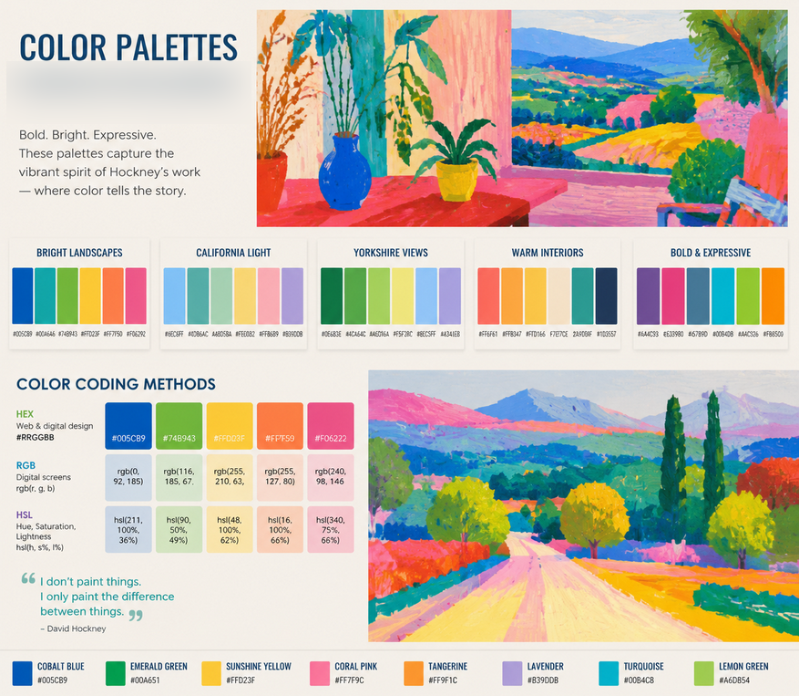

# Web Color Design Guide

This repository contains a complete guide to using colors in web design. It includes color names, coding methods (HEX, RGB, HSL), and practical examples of modern color palettes.

## Features
- CSS color methods
- Named colors reference
- Color theory basics
- Real-world color palettes
- Web design examples

## Purpose
To help developers and designers understand and apply colors effectively in web projects.